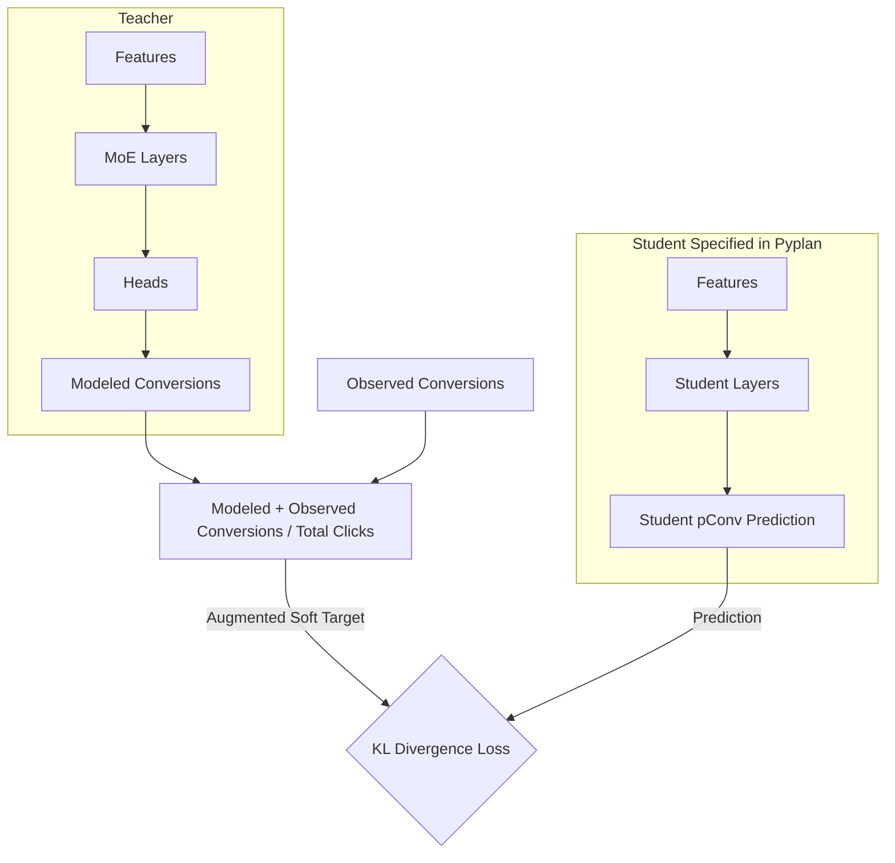
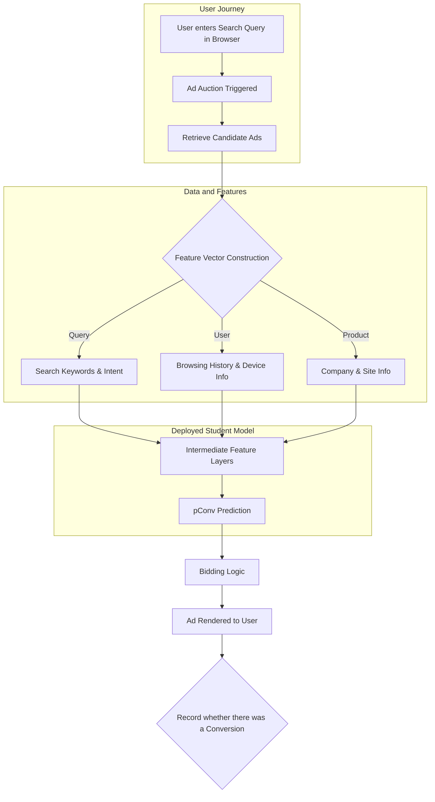

# Efficient Model Compression for Conversion Prediction
COMS E6998 - High-Performance Machine Learning (Final Project)
Columbia University

## Overview

This repository contains our experimental configs used to evaluate the effectiveness of several model-compression strategies for compressing large-scale conversion prediction models used in Google Ads. These models face strict constraints on latency, memory footprint, and serving cost, motivating the need for efficient student architectures that can preserve predictive performance while reducing inference overhead.

Our work evaluates the effectiveness of several model-compression strategies:

* Knowledge Distillation (KD)
* Feature-Based Distillation (intermediate-layer matching)
* INT8 Post-Training Quantization (PTQ)
* Prototype pruning approaches

> [!NOTE]
> Much of our project was done in Google's internal infrastructure, and as such, we were unable to provide a complete codebase for our project. We have provided the experimental configs we used to define our experiments. Additionally, with the professor's permission, we used Google's internal profiling tools to evaluate the performance of our student models.



The combined KD + INT8 pipeline produced the strongest student model, demonstrating high efficiency without degrading predictive reliability.

## Results


| Method                   | PLL Change | Latency Impact | Notes                |
|--------------------------|------------|----------------|----------------------|
| KD + INT8 Quantization   | -0.15%     | -0.14 ms       | Strong trade-off     |
| Feature KD               | Slight gain| Minimal        | Outperformed basic KD|
| Basic KD                 | -.75%      | Minimal        | Good baseline        |
| Pruning (proto)          | N/A        | N/A            | Not fully integrated |

For the KD + INT8 Quantization model, we observed the following as well:
* Reduced TPU compute usage
* Significant increases in advertiser spend and desired spend

These results with more details can be found in our final report.

## Repository Structure

```
COMS-E6998-final-project/
│
├── knowledge_distillation/
│ ├── distillation_v1.py
│ └── distillation_v2.py
│
├── pruning/
│ ├── pruning_v1.py
│ └── pruning_v2.py
│
├── quantization/
│ ├── quantization_v1.py
│ └── quantization_eval.py
│
├── results/
│ ├── latency_results/ # screenshots or exported tables from report
│ ├── roi_results/ # ROI comparison images
│ └── other_figures/ # additional experiment visualizations
│
├── model.py
├── config_v1.py
├── example_nb.ipynb   # to simulate a full workflow 
└── README.md
```

## Pyplan Configuration

We utilized Pyplan configurations to define our student model architectures. These configurations were imported and carefully adapted to integrate seamlessly with Google's internal infrastructure. This ensured compatibility with the existing training and inference pipelines. We mapped the Pyplan model specifications to the corresponding internal components and optimized operations for the target hardware acceleration.

## Interpretation & Discussion

Our findings show that knowledge distillation paired with INT8 quantization provides the a compelling balance of accuracy and efficiency for conversion prediction models operating in latency-constrained environments.

### Key Takeaways
* Efficiency vs. Accuracy: KD + INT8 quantization provided the best balance, meeting strict latency constraints.
* High-Value Impact: The model showed strong ROI, specifically improving performance on high-value (high tCPA) traffic.
* Infrastructure Hurdles: Adapting PyTorch code to internal declarative frameworks (Pyplan) was a major complexity driver.
* Constraint Adaptation: Development was focused on post-training techniques due to pre-trained teacher constraints and production freezes.

## Future Work

* Online Knowledge Distillation: Implement online strategies to address prediction lag and robustness issues.
* Advanced Pruning: Explore structured and movement pruning for further model compression.
* Quantization-Aware Training (QAT): Investigate QAT to enable lower-bit precision.
* Robustness: Reduce reliance on fallback models by improving student confidence interval coverage.

## Deployment Usage Diagram


## Team
* Mahdi Saleh Tabesh
* Alex Racapé
* Rohan Singh
* Kimberly Collins

